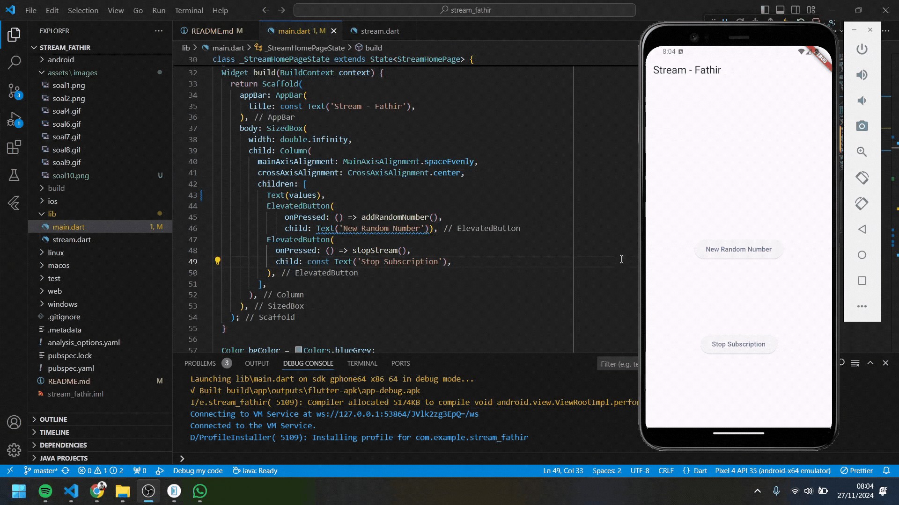

Nama    : Ahmed Fathir Syafaat

Kelas   : TI - 3H

NIM     : 2241720083

# #12 | Lanjutan State Management dengan Streams

## Praktikum 1: Dart Streams
### Soal 1

### Soal 2

### Soal 3
Jelaskan fungsi keyword yield* pada kode tersebut!
> yield* berfungsi untuk menghasilkan setiap elemen objek Stream secara berurutan.

Apa maksud isi perintah kode tersebut?
> membuat sebuah stream yang menghasilkan warna-warna secara periodik dari daftar warna dengan interval waktu 1 detik.

### Soal 4

### Soal 5
Jelaskan perbedaan menggunakan listen dan await for (langkah 9) !
> - listen adalah metode dari class Stream yang digunakan untuk mendengarkan elemen-elemen yang dipancarkan oleh stream.
> - await for adalah cara untuk membaca data dari stream secara asynchronous. Cara ini hanya bisa digunakan dalam fungsi dengan deklarasi async.

### Soal 6
Jelaskan maksud kode langkah 8 dan 10 tersebut!
> - Langkah 8 (initState): Menyiapkan listener untuk mendengarkan data dari stream dan memperbarui tampilan aplikasi setiap kali data baru diterima.
> - Langkah 10 (addRandomNumber): Menambahkan data angka acak ke dalam stream sehingga listener di langkah 8 dapat mendeteksi dan memperbarui state.

Capture hasil praktikum Anda berupa GIF dan lampirkan di README.

### Soal 7
Jelaskan maksud kode langkah 13 sampai 15 tersebut!
> - Langkah 13: Menyediakan mekanisme untuk menampilkan error melalui stream.
> - Langkah 14: Menambahkan handler untuk mendeteksi error dari stream dan meresponsnya dengan menetapkan nilai -1 pada state.
> - Langkah 15: Mengganti fungsionalitas memasukkan angka acak dengan menampilkan error sehingga memungkinkan pengujian handler error.

Capture hasil praktikum

### Soal 8
Jelaskan maksud kode langkah 1-3 tersebut!
> - Langkah 1: Menyiapkan sebuah transformer untuk digunakan dalam mengolah data yang melewati stream.
> - Langkah 2: Mendefinisikan bahwa transformer ini menerima stream bertipe int dan juga mengembalikan data bertipe int.
> - Langkah 3: Menggunakan transformer yang telah didefinisikan di langkah 2 untuk memodifikasi aliran data. Data yang melewati stream akan diproses oleh transformer dengan mengalikan data dengan 10 atau mengganti error dengan -1.

Capture hasil praktikum Anda berupa GIF dan lampirkan di README.

### Soal 9
Jelaskan maksud kode langkah 2, 6 dan 8 tersebut!
> - Langkah 2: Membuat listener untuk stream dan menghubungkannya dengan UI, lalu listener menangkap data baru dan memperbarui state.
> - Langkah 6: Menutup stream controller dan membatalkan listener ketika widget dihapus untuk mencegah kebocoran memori.
> - Langkah 8: Menambahkan angka acak ke stream, tetapi memastikan bahwa proses tersebut hanya dilakukan jika stream controller masih terbuka. Jika controller sudah ditutup, aplikasi menangani situasi tersebut dengan memperbarui state.

Capture hasil praktikum Anda berupa GIF dan lampirkan di README.

### Soal 10

Jelaskan mengapa error itu bisa terjadi ?
>  Error terjadi ketika subscription2 diaktifkan, hal ini terjadi karena stream hanya dapat didengarkan oleh satu pendengar secara default.

### Soal 11
Jelaskan mengapa hal itu bisa terjadi ?
> Setelah menjadi broadcast stream, kedua listener menerima data yang sama. Karena setiap listener memodifikasi values, angka ditambahkan dua kali.

Capture hasil praktikum Anda berupa GIF dan lampirkan di README.
